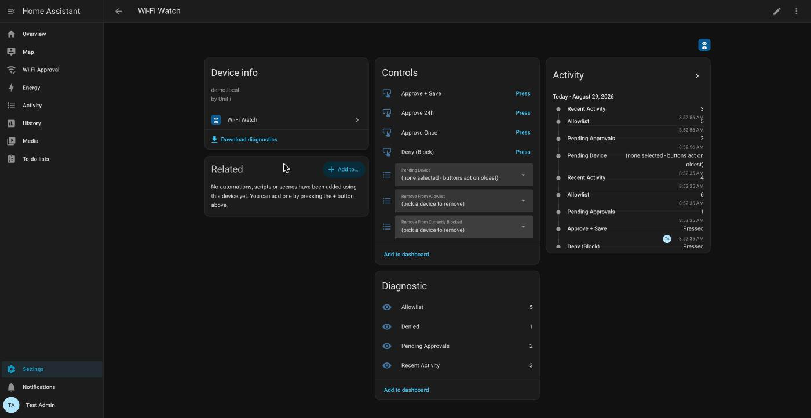
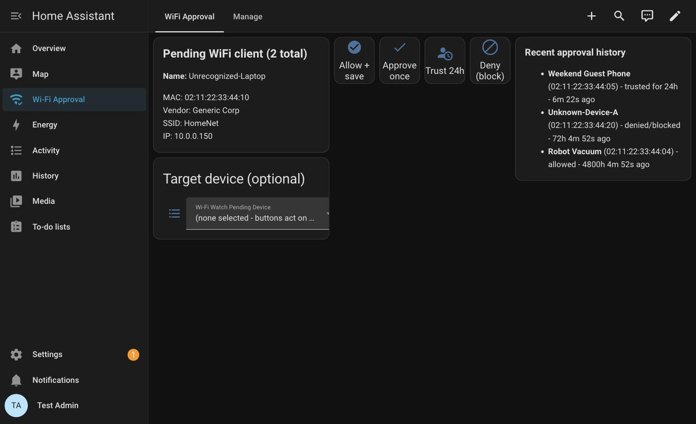
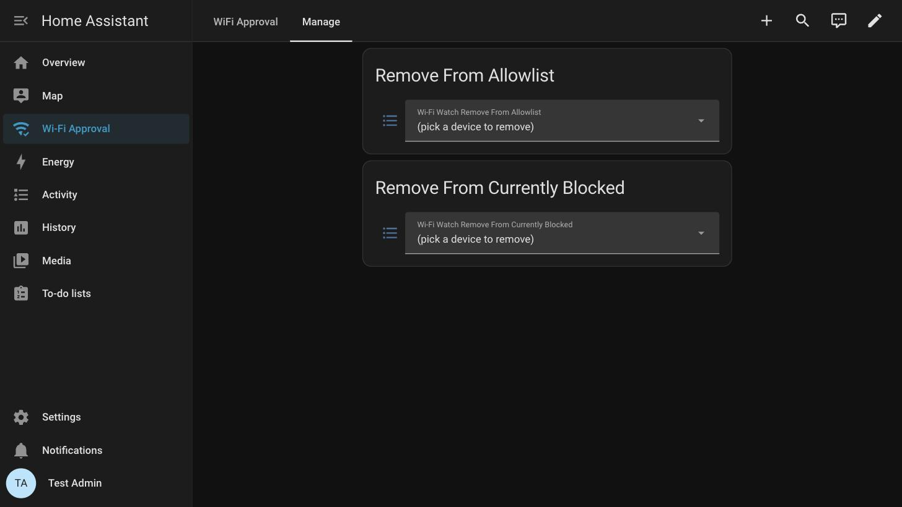

# wifi-watch

Get notified when an unrecognized device joins your Wi-Fi, and approve,
approve-once, approve for 24 hours, or block it from an actionable
notification (within Home Assistant Companion on your phone, or Home
Assistant itself).

## How it works

Every few seconds (configurable), the integration polls your UniFi
controller's wireless client list. A client whose MAC isn't already on your
allowlist triggers a push notification with four actions:

- **Approve + Save** - adds it to the allowlist permanently; you won't be
  asked about it again.
- **Approve Once** - lets it on this one time; you'll be asked again next
  time it connects.
- **Approve 24h** - lets it on for a day, then quietly removes it from the
  allowlist; see Entities below for what happens if it's still connected
  when that expires.
- **Deny (Block)** - blocks the device at the UniFi controller.

If `auto_block` is enabled (off by default), a new device is blocked
immediately on detection instead of waiting for you to act - it stays
blocked until you tap Approve or Deny.

A burst of new devices (like a phone, watch, and laptop all reconnecting
together after a reboot) triggers one combined alert instead of a
separate push for each - so you're not flooded with notifications. Each
device still shows up on its own, ready to review and approve or deny
individually.

If the integration can't reach your UniFi controller for more than a
minute, a Repairs entry appears under **Settings → System → Repairs** -
it clears on its own once polling recovers.

## Requirements

- A UniFi Network controller reachable from Home Assistant.
- **Two separate UniFi credentials**:
  - An **integration API key** - used for the poll loop that checks for
    new/unrecognized devices every few seconds.
  - A **dedicated local UniFi account** (username + password) - used only
    for blocking/unblocking and SSID lookups. Give it **Full Management**
    under the Network role dropdown (required for blocking/unblocking) and
    leave the other role categories at **None** - don't reuse your own
    admin login.

  To create both:

  - **API key**: the **Integrations** icon in the left sidebar → **Create
    New API Key** → name it (e.g. "Wi-Fi Watch") → copy the key
    immediately, UniFi typically only shows it once.
  - **Dedicated account**: the **People** icon at the bottom of the left
    sidebar → **Create New → Create New User** → fill in
    First/Last Name → check **Admin** (reveals more fields) → check
    **Restrict to Local Access Only** (local username/password login, not
    a cloud/email invite) → set **Username** and **Password** (12
    characters minimum) → set the **Network** role dropdown to **Full
    Management**, leave the other role dropdowns at **None** →
    **Create**.
- The Home Assistant mobile app installed on whichever phone(s) should get
  the approval notifications, with notifications enabled for it.
- Home Assistant 2026.1.0 or newer.
- Home Assistant reachable from wherever you'll be tapping notification
  actions from - see External reachability below if that's not just "at
  home on your own Wi-Fi" for you.

## Install

**Via HACS**: HACS → Integrations → ⋮ → Custom repositories → add this
repo's URL as type "Integration" → install "Wi-Fi Watch" → restart Home
Assistant.

**Manually**: copy the `custom_components/wifi_watch/`
directory from this repo into your Home Assistant config's
`custom_components/` directory, then restart Home Assistant.

Either way, after restart: **Settings → Devices & Services → Add
Integration → search "Wi-Fi Watch"**.

## Setup

The config flow is two short steps:

1. **Connection**: controller host/IP, integration API key, dedicated
   account username/password (see Requirements above for both
   credentials).
2. **Site**: skipped automatically if your controller only has one site;
   otherwise pick it from a dropdown, no UUID-hunting required.

If setup fails with "couldn't connect," it's almost always the API key or
the dedicated account's credentials.

If your UniFi credentials rotate or expire, Home Assistant will prompt you
to reauthenticate - click through it and re-enter the new password.

## Notify targets

Every alert creates a Home Assistant notification and broadcasts to
every device with the Home Assistant Companion app installed. Pair a phone
with the Companion app after setup and it starts getting notified
immediately; unpair it and it drops off on its own. To stop notifying a
specific target without unpairing it, exclude it in Options below.

## Options

**Settings → Devices & Services → Wi-Fi Watch → Configure**, changeable
without removing and re-adding the integration:

| Option | Default | Notes |
|---|---|---|
| Notify targets to exclude | none | Opt specific targets out of the broadcast described above |
| Poll interval | 7s | How often the UniFi client list is checked |
| Notify debounce | 90s | Suppresses a duplicate notification for the same MAC+SSID within this window |
| Retention window | 30 days | How long old sessions/denials/notify history are kept before pruning |
| Approval link expiry | 24h | How long a pending token stays valid before it silently expires |
| Auto-block new devices | off | See "How it works" above |

## Entities

Everything lives on one device page ("Wi-Fi Watch") - buttons to act on a
device, dropdowns to remove one, and sensors showing what's currently
allowed, blocked, or waiting:



- **Pending Approvals**, **Allowlist**, **Denied**, **Recent Activity** -
  diagnostic sensors, each a count with an attribute listing the actual
  entries (device name, MAC, IP, SSID, vendor, block status, first/last
  seen, etc.).
- **Approve + Save**, **Approve 24h**, **Approve Once**, **Deny (Block)** -
  buttons that act on whichever device is picked in Pending Device below,
  or the oldest pending device if nothing's picked - same effect as
  tapping a notification action. Approve 24h allowlists temporarily: the
  device gets full access for 24 hours, then is quietly removed from the
  allowlist. If it's still connected when that happens it isn't kicked off
  mid-session - it just won't be auto-trusted again the next time it
  actually reconnects, and gets a fresh prompt like any unrecognized
  device.
- **Pending Device** - a dropdown listing every currently-pending device by
  name; pick one to target the four buttons above at it specifically
  instead of whichever is oldest. Resets to "none selected" automatically
  once its device is decided, expires, or reconnects under a new session.
- **Remove From Allowlist**, **Remove From Currently Blocked** - dropdowns
  listing the real allowlist/denied devices as always-current options;
  picking one removes it immediately.

## Services

- `wifi_watch.decide` - act on a pending device by token: `token` +
  `action` (`allow` | `approve` | `guest` | `deny`). Same effect as
  tapping a notification button; useful for building your own dashboard
  controls (see below) or automations.
- `wifi_watch.allowlist_remove` - takes a device off the allowlist; it'll
  get a fresh approval prompt next time it reconnects.
- `wifi_watch.denied_remove` - unblocks a currently-blocked device.
  `allowlist: true` also allowlists it in the same call ("I denied that by
  accident"); `allowlist: false` (default) leaves it unknown, so it'll get
  a fresh prompt on reconnect.
- `wifi_watch.test_notification` - sends a plain test push to every notify
  target (see Notify targets above), no actions, just to confirm delivery
  works.

## Dashboard (optional)

The push notification alone is a complete approve/deny flow, and every
entity above already shows up on the integration's own device page
(Settings → Devices & Services → Wi-Fi Watch → the device) - you don't
need a dashboard for wifi-watch to work. If you'd rather have a dedicated
view (e.g. to see the pending device at a glance without opening the
device page), this repo ships one.

1. **Settings → Dashboards → Add Dashboard**, then click the **New
   dashboard from scratch** card (the `+` tile).
2. Fill in **Title** (e.g. "Wi-Fi Approval") and **Icon** (e.g.
   `mdi:wifi-check`) - leave URL at its auto-filled value, **Admin-only**
   off, and **Add to sidebar** on - then **Create**.
3. Open the new dashboard, click the pencil (**Edit Dashboard**) icon, then
   the **⋮** menu → **Raw configuration editor**.
4. Delete the placeholder content, paste in the YAML below, and **Save**.

```yaml
views:
- title: Wi-Fi Approval
  path: '0'
  cards:
  - type: conditional
    conditions:
    - entity: sensor.wi_fi_watch_pending_approvals
      state_not: '0'
    card:
      type: vertical-stack
      cards:
      - type: markdown
        content: >-
          
          
          
          
          
          ## {{ 'Selected' if matches else 'Pending' }} Wi-Fi client ({{ states('sensor.wi_fi_watch_pending_approvals') }} total)


          **Name:** {{ p.get('name') }}


          MAC: {{ p.get('mac') }}{{ ' [randomized/private MAC]' if p.get('randomized') else '' }}<br>Vendor: {{ p.get('vendor') or 'unknown' }}<br>SSID: {{ p.get('ssid') or 'unknown' }}<br>IP: {{ p.get('ip') }}{{ '<br>BLOCKED' if p.get('blocked') else '' }}
      - type: horizontal-stack
        cards:
        - type: button
          entity: button.wi_fi_watch_allow_save
          name: Approve + Save
          icon: mdi:check-circle
          show_state: false
          tap_action:
            action: call-service
            service: button.press
            target:
              entity_id: button.wi_fi_watch_allow_save
        - type: button
          entity: button.wi_fi_watch_trust_for_24h_guest
          name: Approve 24h
          icon: mdi:account-clock
          show_state: false
          tap_action:
            action: call-service
            service: button.press
            target:
              entity_id: button.wi_fi_watch_trust_for_24h_guest
        - type: button
          entity: button.wi_fi_watch_approve_once
          name: Approve Once
          icon: mdi:check
          show_state: false
          tap_action:
            action: call-service
            service: button.press
            target:
              entity_id: button.wi_fi_watch_approve_once
        - type: button
          entity: button.wi_fi_watch_deny
          name: Deny (Block)
          icon: mdi:block-helper
          show_state: false
          tap_action:
            action: call-service
            service: button.press
            target:
              entity_id: button.wi_fi_watch_deny
      - type: entities
        title: Pick a device (optional)
        show_header_toggle: false
        entities:
        - entity: select.wi_fi_watch_pending_device
  - type: conditional
    conditions:
    - entity: sensor.wi_fi_watch_pending_approvals
      state: '0'
    card:
      type: markdown
      content: '## ✅ No pending requests'
  - type: markdown
    content: '### Recent approval history

      - **{{ h.name
      }}** ({{ h.mac }}) - {{ h.action }} - {{ diff }}s{{ (diff // 60) }}m {{ (diff % 60) }}s{{ (diff // 3600) }}h {{ ((diff % 3600) // 60) }}m {{ (diff % 60) }}s{{ (diff // 86400) }}d {{ ((diff % 86400) // 3600) }}h {{ ((diff % 3600) // 60) }}m ago

      *Nothing yet.*

      '
- title: Manage
  path: manage
  cards:
  - type: entities
    title: Remove From Allowlist
    show_header_toggle: false
    entities:
    - entity: select.wi_fi_watch_remove_from_allowlist
  - type: entities
    title: Remove From Currently Blocked
    show_header_toggle: false
    entities:
    - entity: select.wi_fi_watch_remove_from_currently_blocked
```




## Diagnostics

**Settings → Devices & Services → Wi-Fi Watch → Download Diagnostics** -
UniFi credentials and the dedicated account's password are redacted
automatically.

## Uninstall

- **Integration**: Settings → Devices & Services → Wi-Fi Watch → ⋮ →
  Delete - also deletes its stored state (allowlist, denials, history).
- **Dashboard** (if added): Settings → Dashboards → open "Wi-Fi Approval"
  (or whatever you titled it) → ⋮ → **Delete Dashboard**.

The dashboard is your own dashboard, not something the integration owns -
deleting the integration alone won't remove it.

## External reachability

Receiving a push notification doesn't require Home Assistant to be
reachable from outside your home network - that leg is Home Assistant
pushing out to Apple/Google's push service regardless. Acting on it
(tapping a notification action button) does: the tap has to reach back to
Home Assistant's API, which only works from outside your LAN if Home
Assistant is externally reachable somehow. At home on your own Wi-Fi this
isn't a factor either way. Options, easiest first:

- **[Nabu Casa Cloud](https://www.nabucasa.com/)** - paid subscription,
  official, handles remote access and TLS with no networking setup on your
  end.
- **A VPN back to your home network** (Tailscale, WireGuard) - free, phone
  reaches Home Assistant as if it were on the LAN.
- **Your own reverse proxy with TLS**, port-forwarded - free, but you own
  the security exposure of putting Home Assistant's web UI on the
  internet.
